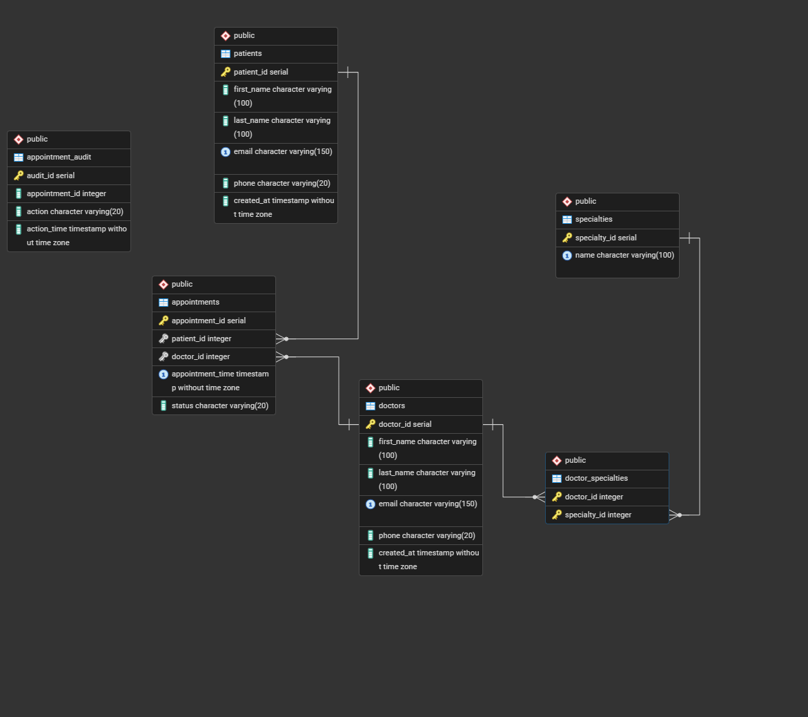

# Medical Appointment Database

A relational database I built in PostgreSQL to practice database design, stored procedures and triggers. The system manages appointments between patients and doctors, handles scheduling conflicts and tracks changes automatically.

## What I built

- Designed a normalized schema with 6 tables, custom ENUM types, foreign key constraints and composite indexing for optimized query performance.
- Built 4 PL/pgSQL stored functions handling appointment scheduling, cancellation and availability checks, with built-in conflict detection and exception handling.
- Implemented 2 stored procedures — `reschedule_appointment` and `cancel_all_appointments` — for managing appointment updates and bulk cancellations.
- Implemented audit triggers for automated change tracking and 3 analytical views providing real-time insights into doctor schedules and appointment statistics.

## Database Diagram

